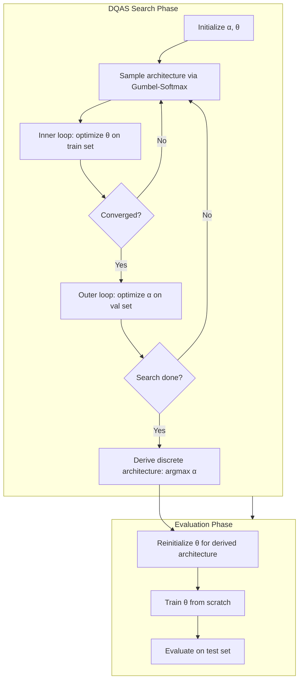
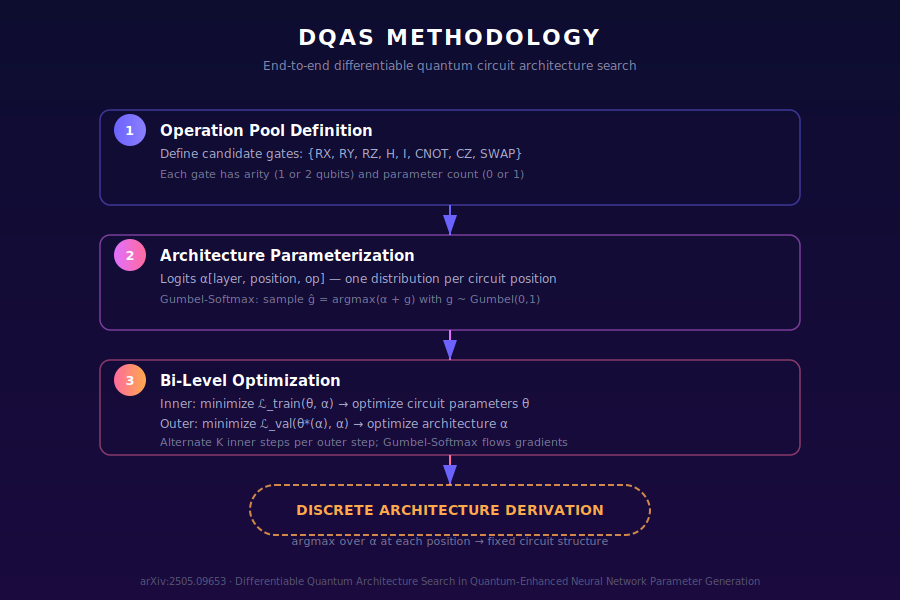
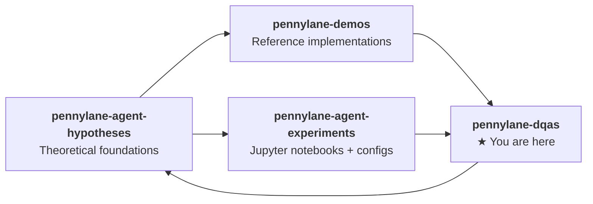

<div align="center">

# ⚛️ PennyLane DQAS

**Differentiable Quantum Architecture Search**

[](https://pennylane.ai)
[](https://pytorch.org)
[](https://arxiv.org/abs/2505.09653)
[](LICENSE)
[](https://python.org)
[](https://github.com/psf/black)

**Automated variational circuit design via end-to-end gradient-based architecture search — built on PennyLane + PyTorch**

[Overview](#overview) • [Methodology](#methodology) • [Installation](#installation) • [Quick Start](#quick-start) • [Experiments](#experiments) • [Architecture](#architecture) • [Papers](#papers) • [Ecosystem](#ecosystem)

---

<p align="center">
  
</p>

</div>

---

## Overview

**Differentiable Quantum Architecture Search (DQAS)** automates the design of variational quantum circuits by treating architectural choices (which gates to apply at each position) as differentiable parameters. Instead of manually designing ansätze, DQAS discovers optimal circuit structures via gradient-based bi-level optimization.

This repository implements the core algorithm from **arXiv:2505.09653** (*Differentiable Quantum Architecture Search in Quantum-Enhanced Neural Network Parameter Generation*, Chen et al., 2025) using **PennyLane** for quantum circuit simulation and **PyTorch** for differentiable architecture optimization.

**Key features:**
- **Operation pool** — configurable set of candidate gates (RX, RY, RZ, H, CNOT, CZ, etc.)
- **Gumbel-Softmax sampling** — differentiable discrete architecture selection
- **Bi-level optimization** — alternating inner (circuit params) and outer (arch params) loops
- **Automatic architecture derivation** — extract the final circuit structure after search
- **Extensible design** — swap in custom gate pools, layer topologies, or tasks

### Why DQAS?

| Challenge | DQAS Solution |
|-----------|--------------|
| Manual ansatz design requires quantum expertise | Automated discovery from an operation pool |
| Barren plateaus from poor circuit structure | Architecture search finds trainable circuits |
| Fixed circuits can't adapt to task difficulty | Task-specific architecture optimization |
| Discrete architecture choices non-differentiable | Gumbel-Softmax relaxation enables end-to-end gradients |

---

## Methodology



### Bi-Level Optimization Formulation

```
Inner loop:    θ* = argmin_θ   ℒ_train(θ, α)
Outer loop:    α* = argmin_α   ℒ_val(θ*(α), α)
```

- **Inner loop**: Gradient descent on circuit parameters θ to minimize training loss
- **Outer loop**: Gradient descent on architecture logits α to minimize validation loss
- **Gumbel-Softmax trick**: Makes discrete sampling differentiable: `z = softmax((α + g) / τ)` where `g ~ Gumbel(0,1)`

### Architecture Representation

Each circuit position maintains logits over the operation pool:

```python
# Architecture: [n_layers, n_positions, n_ops] logits
# n_positions = n_qubits (single-qubit) + (n_qubits-1) (two-qubit)
# During search: Gumbel-Softmax samples operations differentiably
# After search:  argmax yields the discrete architecture
```

<div align="center">
  
</div>

---

## Installation

```bash
# Clone the repository
git clone https://github.com/NullLabTests/pennylane-dqas.git
cd pennylane-dqas

# Install dependencies (choose one)
pip install -r requirements.txt       # minimal
pip install -e .                       # editable install
```

**Requirements:**
- Python ≥ 3.10
- PennyLane ≥ 0.38
- PyTorch ≥ 2.0
- NumPy ≥ 1.24
- scikit-learn ≥ 1.3

---

## Quick Start

```python
from dqas.core import DQASCircuit, OperationPool
from dqas.search import DQASSearcher
from dqas.utils import generate_synthetic_data
import pennylane as qml

# 1. Setup
pool = OperationPool(["RX", "RY", "RZ", "H", "CNOT", "CZ"])
circuit = DQASCircuit(n_qubits=4, n_layers=3, op_pool=pool)
dev = qml.device("default.qubit", wires=4)

# 2. Generate data
X_train, y_train = generate_synthetic_data(n_samples=100, n_features=4)
X_val, y_val = generate_synthetic_data(n_samples=50, n_features=4)

# 3. Run architecture search
searcher = DQASSearcher(circuit, dev)
history = searcher.search(X_train, y_train, X_val, y_val, n_epochs=30)

# 4. Evaluate discovered architecture
results = searcher.evaluate(X_val, y_val)
print(f"Test loss: {results['test_loss']:.4f}")
print(f"Architecture: {results['architecture']}")
```

---

## Experiments

### Classification

Discover an optimal circuit architecture for binary classification:

```bash
python -m experiments.classification --n-qubits 4 --n-layers 3 --n-epochs 30
```

### Time-Series Prediction

Discover an optimal circuit for forecasting sinusoidal time series:

```bash
python -m experiments.timeseries --n-qubits 4 --n-layers 3 --n-epochs 30
```

All results are saved as JSON to the `results/` directory.

### Experiment Configuration

| Parameter | Default | Description |
|-----------|---------|-------------|
| `--n-qubits` | 4 | Number of qubits |
| `--n-layers` | 3 | Number of circuit layers |
| `--n-epochs` | 30 | Outer optimization epochs |
| `--lr-circuit` | 0.05 | Learning rate for circuit params |
| `--lr-arch` | 0.01 | Learning rate for architecture params |
| `--seed` | 42 | Random seed |
| `--results-dir` | results | Output directory |

---

## Architecture

```
pennylane-dqas/
├── dqas/                          # Core DQAS package
│   ├── core.py                    # OperationPool, MixedLayer, DQASCircuit
│   ├── search.py                  # DQASSearcher (bi-level optimization)
│   ├── layers.py                  # Predefined circuit layer templates
│   └── utils.py                   # Data generation, printing, counting
├── experiments/                   # Run scripts
│   ├── classification.py          # Classification experiment
│   └── timeseries.py              # Time-series experiment
├── assets/                        # Visual assets
│   ├── dqas_overview.svg          # Logo / overview diagram
│   └── methodology.svg            # Methodology pipeline diagram
├── results/                       # Experiment outputs (gitignored)
├── requirements.txt
├── setup.py
└── README.md
```

### Key Modules

| Module | Description |
|--------|-------------|
| `OperationPool` | Registry of available quantum gates with arity and parameter info |
| `MixedLayer` | A circuit layer with differentiable Gumbel-Softmax architecture search |
| `DQASCircuit` | Full variational circuit composed of multiple `MixedLayer` instances |
| `DQASSearcher` | Bi-level optimization orchestrator (inner/outer loop) |

---

## Papers

This implementation is primarily based on:

> **Differentiable Quantum Architecture Search in Quantum-Enhanced Neural Network Parameter Generation**  
> Samuel Yen-Chi Chen, et al. (2025)  
> [arXiv:2505.09653](https://arxiv.org/abs/2505.09653) [quant-ph, cs.AI, cs.LG]

**Related works:**

| Paper | Year | Connection |
|-------|------|------------|
| [Quantum Architecture Search with Meta-learning](https://arxiv.org/abs/2106.06248) | 2021 | Meta-learning for QAS initialization |
| [Quantum circuit architecture search for VQAs](https://www.nature.com/articles/s41534-022-00570-y) | 2022 | Foundational QAS framework (npj Quantum Information) |
| [An Introduction to QRL](https://arxiv.org/abs/2409.05846) | 2024 | Quantum RL with architecture search elements |
| [Evaluating NNs vs VQCs](https://arxiv.org/abs/2504.07273) | 2025 | Parameter efficiency of VQCs vs classical NNs |
| [Learning to Measure QNNs](https://arxiv.org/abs/2501.05663) | 2025 | Learnable observables in quantum circuits |

---

## Ecosystem

This repository is part of the **NullLabTests** research ecosystem — three companion repos exploring quantum machine learning from theory to practice:



| Repository | Description |
|-----------|-------------|
| [pennylane-agent-hypotheses](https://github.com/NullLabTests/pennylane-agent-hypotheses) | 5 formal hypotheses on quantum advantage in ML (H1–H5) |
| [pennylane-demos](https://github.com/NullLabTests/pennylane-demos) | Python implementations of core quantum ML algorithms |
| [pennylane-agent-experiments](https://github.com/NullLabTests/pennylane-agent-experiments) | Jupyter notebooks, YAML configs, and experiment lifecycle |
| **pennylane-dqas** (this repo) | Differentiable Quantum Architecture Search — automated circuit design |

---

## Citation

If you use this code in your research, please cite:

```bibtex
@software{pennylane-dqas2025,
  author = {NullLabTests},
  title = {PennyLane DQAS: Differentiable Quantum Architecture Search},
  year = {2026},
  url = {https://github.com/NullLabTests/pennylane-dqas}
}

@article{chen2025differentiable,
  title = {Differentiable Quantum Architecture Search in Quantum-Enhanced
           Neural Network Parameter Generation},
  author = {Chen, Samuel Yen-Chi and others},
  journal = {arXiv preprint arXiv:2505.09653},
  year = {2025}
}
```

---

<div align="center">
  <sub>Built with ⚛️ by <a href="https://github.com/NullLabTests">NullLabTests</a> using <a href="https://pennylane.ai">PennyLane</a> and <a href="https://pytorch.org">PyTorch</a></sub>
</div>
